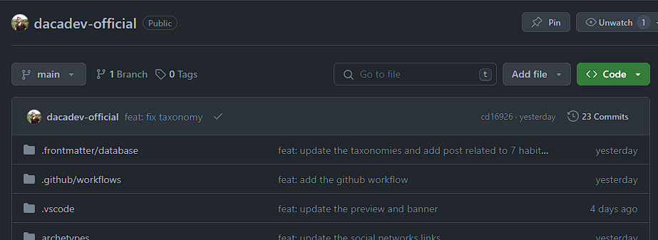
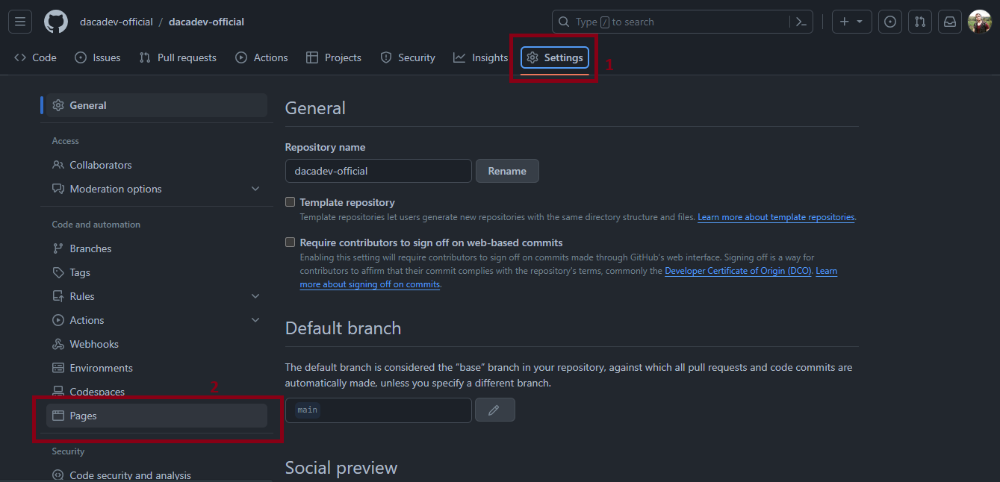
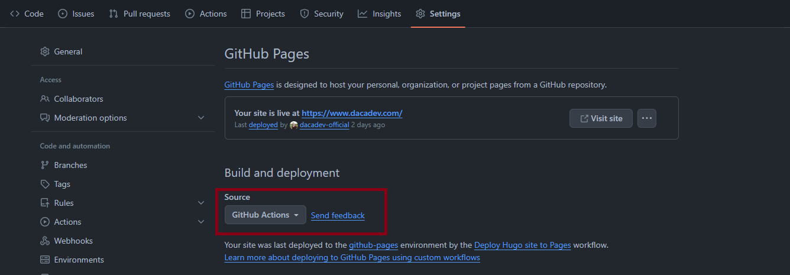
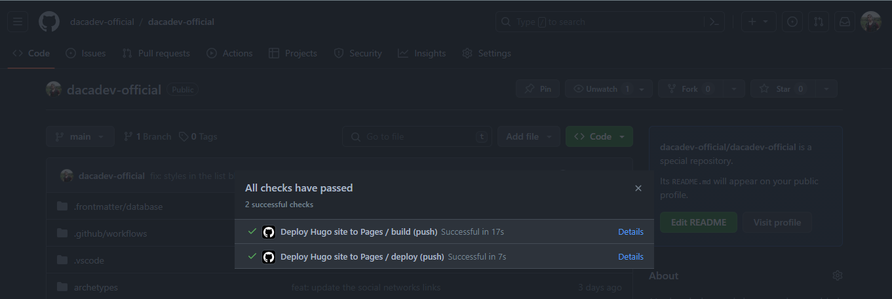
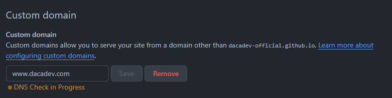
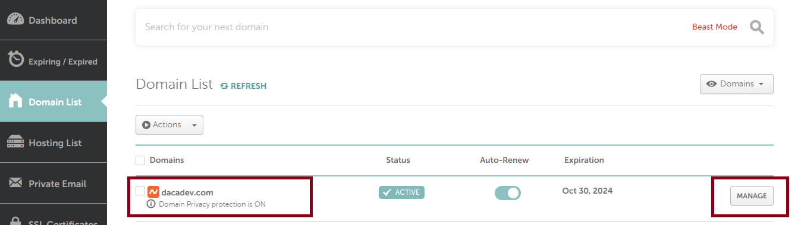
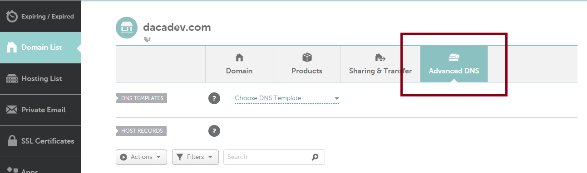
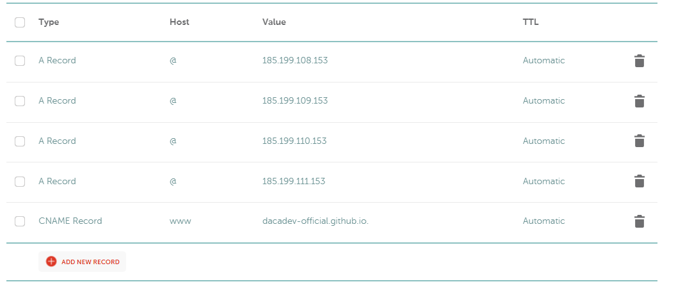

**HUGO** es un generador de sitios estáticos creado en Go, que cuenta con un rendimiento excelente y varias funcionalidades que permiten crear sitios web de manera amigable tanto para desarrolladores como para creadores de contenido.

Para saber más de la herramienta, puedes remitirte a la documentación en el siguiente [link](https://gohugo.io/)

Para desplegar tu sitio web creado con **HUGO**, dispones de muchas herramientas, tanto pagas como gratuitas, que te pueden ayudar en este proceso. En este post, vamos a ver cómo podemos desplegar rápidamente nuestro sitio en GitHub Pages en menos de 10 minutos y actualizar el dominio a uno personalizado.


**GitHub Pages** es un servicio que ofrece **GitHub** para los repositorios públicos o para aquellos usuarios que cuentan con una suscripción pro, sean usuarios personales o empresariales.


## Despliegue paso a paso del sitio en **GitHub** Pages

1. Debes tener un proyecto de HUGO funcional y alojarlo en un repositorio público en **GitHub**.
  
  Si quieres que el repositorio sea privado y aún así desplegar tu sitio, es importante contar con la cuenta Pro.
  
  
  En la imagen de referencia, estoy usando la página especial de **GitHub Pages** que coincide con mi nombre de usuario, [dacadev-official](https://github.com/dacadev-official). Esto significa que cuando despliegue mi sitio, lo harán en la raíz del dominio de mi cuenta, que sería `https://dacadev-official.github.io`. Si el nombre fuera diferente, la URL sería `https://dacadev-official.github.io/<my-repo-name>`. Es importante tener esto en cuenta ya que si en **HUGO** estamos usando `Permalinks` o `relURL` sin tener configurado debidamente nuestro `baseurl`, podría generar problemas en los enlaces.

2. Dentro de nuestro repositorio, nos dirigiremos a la sección de *settings > pages* y activaremos la opción de build and deploy con **GitHub Actions**.
  
  

3. El siguiente paso consiste en activar las **GitHub Actions**. Para ello, debemos crear un archivo dentro del folder `.github/workflows`.
  
  Las **GitHub Actions** son una herramienta de automatización integrada en GitHub, que permite ejecutar flujos de trabajo basados en eventos dentro de un repositorio.
  
  Crearemos el archivo `hugo.yaml` dentro del folder mencionado. Puede ser cualquier nombre, pero lo importante es que sea un nombre relacionado o descriptivo de lo que hará. Dentro de este archivo, colocaremos el siguiente contenido.
  
  
  # Nombre de la acción
name: Deploy Hugo site to Pages

# Se activara cuando se haga un push sobre la rama main
on:
  push:
    branches:
      - main

# Permisos para que pueda leer el contenido del repo y
# pueda escribir sobre la funcionalidad de GitHub Pages
permissions:
  contents: read
  pages: write
  id-token: write

# Estara asociado al grupo relacionados con pages y no cancelará
# otros procesos que esten en ejecución
concurrency:
  group: "pages"
  cancel-in-progress: false

# Define bash como el encargado de ejecutar los trabajos
defaults:
  run:
    shell: bash

# En este apartado define el entorno usado para el workflow
jobs:
	# 1 TRABAJO DE CONSTRUCCIÓN DEL SITIO
  build:
    # Entorno
    runs-on: ubuntu-latest
    env:
			# Esta variable permite cambiar facilmente la version de HUGO usada
      HUGO_VERSION: 0.121.1
    steps:
      - name: Install Hugo CLI
        run: |
          wget -O ${{ runner.temp }}/hugo.deb https://github.com/gohugoio/hugo/releases/download/v${HUGO_VERSION}/hugo_extended_${HUGO_VERSION}_linux-amd64.deb \
          && sudo dpkg -i ${{ runner.temp }}/hugo.deb
      - name: Install Dart Sass
        run: sudo snap install dart-sass
				# Prepara el entorno para desplegar las páginas
      - name: Checkout
        uses: actions/checkout@v4
        with:
          submodules: recursive
          fetch-depth: 0
      - name: Setup Pages
        id: pages
        uses: actions/configure-pages@v4
      - name: Install Node.js dependencies
        run: "[[ -f package-lock.json || -f npm-shrinkwrap.json ]] && npm ci || true"
				# Configura las variables de entorno de HUGO y procede a
				# ejecutar el comando para construir el sitio.
      - name: Build with Hugo
        env:
          HUGO_ENVIRONMENT: production
          HUGO_ENV: production
        run: |
          hugo \
            --gc \
            --minify \
            --baseURL "${{ steps.pages.outputs.base_url }}/"
	      # Sube el contenido generado por hugo al directorio de GitHub Pages
			- name: Upload artifact
        uses: actions/upload-pages-artifact@v2
        with:
          path: ./public

  # 2 REDESPLIEGA EL SITIO EN GITHUB PAGES CON LOS NUEVOS CAMBIOS
  deploy:
    environment:
      name: github-pages
      url: ${{ steps.deployment.outputs.page_url }}
    runs-on: ubuntu-latest
    needs: build
    steps:
      - name: Deploy to GitHub Pages
        id: deployment
        uses: actions/deploy-pages@v3
  
  

4. El siguiente paso es hacer commit con el nuevo archivo agregado, con un mensaje descriptivo, y finalmente hacer push de los cambios a la rama main o la que hayas definido en el archivo .yaml de configuración.
  
  
git commit -m "feat: implement github actions to deploy site into GitHub Pages" 
git push origin main
  
  

5. Nos dirigiremos a la página de nuestro repositorio y veremos que **GitHub** ha detectado automáticamente nuestros cambios con las acciones y las ejecutará. Verás algo similar a la siguiente imagen.
   
   Una vez que se completen los workflows correctamente, debes dirigirte a la URL del repositorio, que sería `https://<username>.github.io/<repository>`. Recuerda que si tu repositorio tiene el mismo nombre que tu usuario, puedes omitir el `<repository>`.
   
   En caso de que se genere un error o algo similar debes de revisar los logs de cada paso que enontrarás en el link de details al lado de cada uno de los pasos
    

## Configura un dominio personalizado en **GitHub Pages**

Hasta este punto, hemos configurado y desplegado exitosamente nuestro sitio en **GitHub Pages**. Ahora, lo que nos falta es configurar nuestro nombre de dominio para que tenga un nombre de nuestra marca o necesidad en cuestión.

En este ejemplo, hemos usado un dominio adquirido en [Namecheap](https://www.namecheap.com/) que tenemos listo para configurar.

1. Lo primero que haremos es configurar nuestro dominio dentro de nuestro repositorio. Para ello, nos dirigiremos a settings > pages de nuevo y buscaremos la opción de Custom Domain.
2. Dentro del input, agregamos el dominio que queremos agregar.
   
3. El siguiente paso será configurar las direcciones IP a las cuales queremos que apunte nuestro dominio. Para ello, nos dirigiremos al panel de control de Namecheap e iremos a las opciones avanzadas de nuestro dominio.
   
   
4. Finalmente, agregamos la siguiente configuración:
   
   Las URL listadas son las siguientes:
   - 185.199.108.153
   - 185.199.109.153
   - 185.199.110.153
   - 185.199.111.153

  Lo que estamos configurando es lo siguiente:
  
  - **Registros A** con la dirección `@`, que representa la raíz del dominio, apuntando a cuatro direcciones IP diferentes. Son necesarios para que tu dominio personalizado apunte a los servidores de **GitHub Pages**. Esto permite que cuando alguien ingrese tu dominio en su navegador, la solicitud sea dirigida a los servidores de GitHub, donde está alojado tu proyecto.
  - **Registro CNAME** con el host `www` y el valor `<username>.github.io`., redirige las solicitudes de `www.tudominio.com` al subdominio` <username>.github.io` en **GitHub**. Esto es útil si quieres que tanto `www.tudominio.com` como `tudominio.com` muestren tu proyecto en **GitHub Pages**.

Ya con esto, tu sitio estaría listo para servir a través de tu dominio personalizado. 🙌


Debes esperar un tiempo para que GitHub confirme que el dominio ingresado está configurado correctamente.

